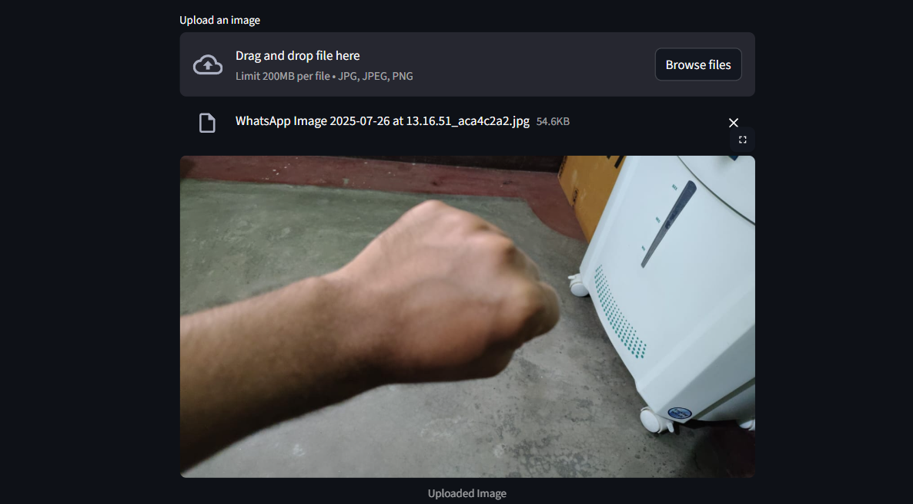
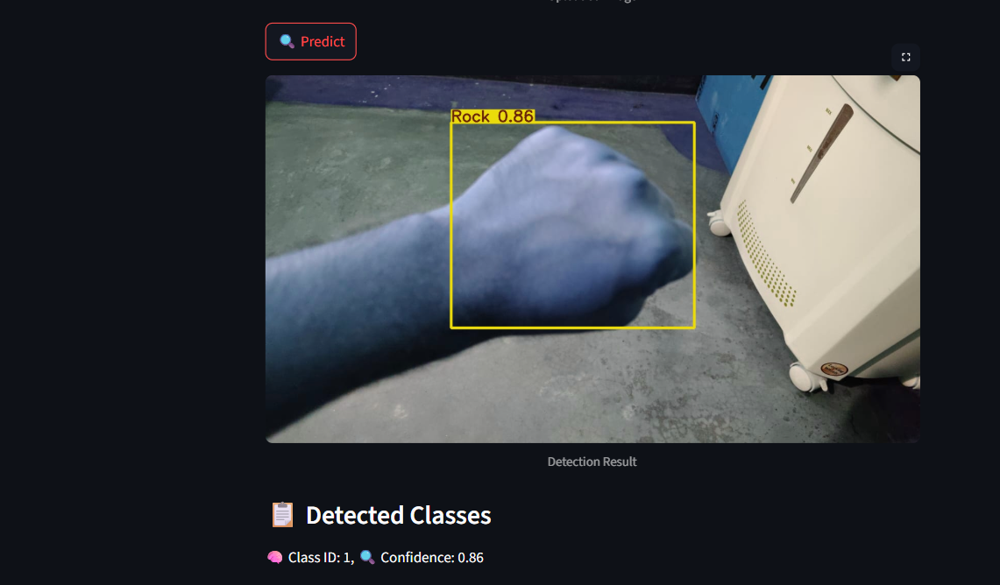
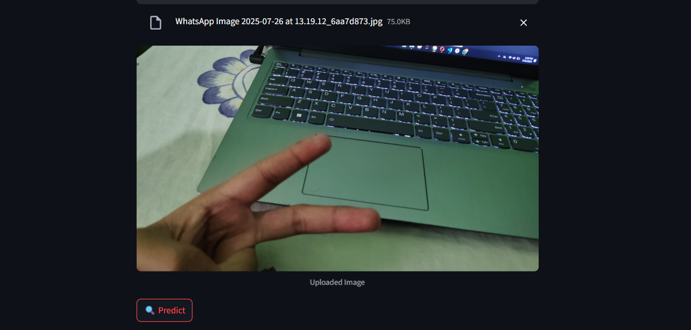
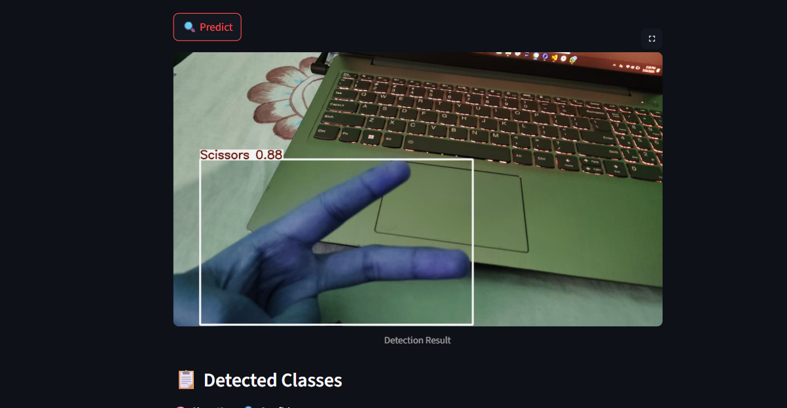
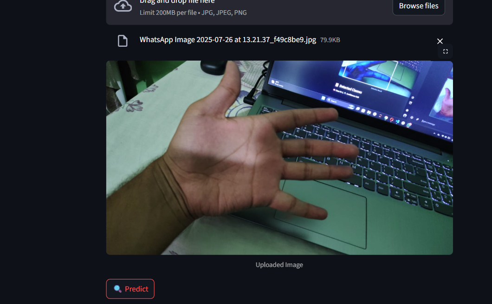
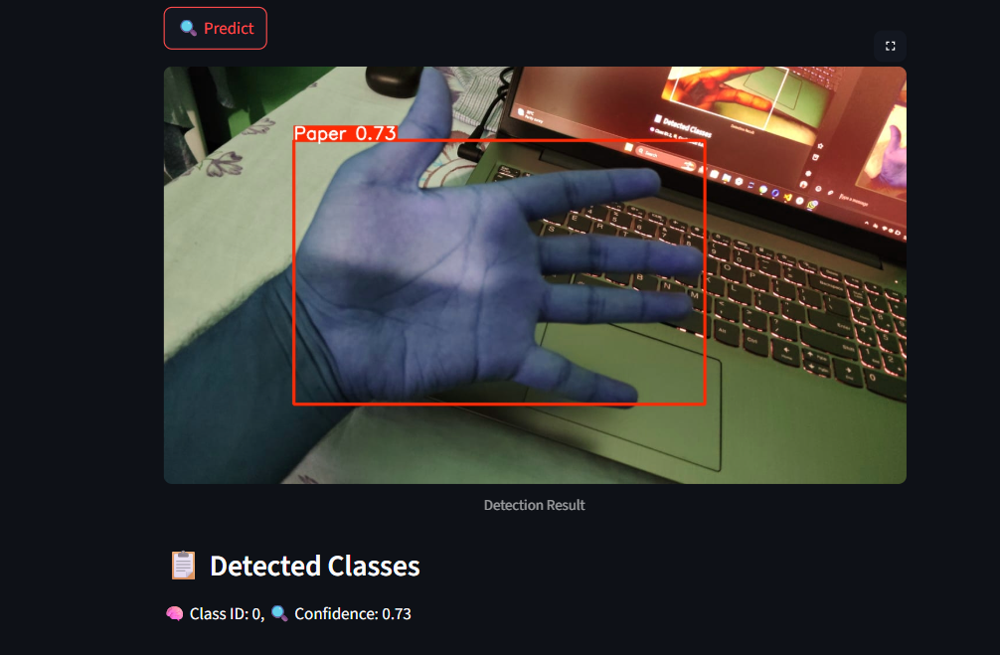

# 🪨✂️🧻 Rock-Paper-Scissors Detection App (YOLOv8 + Streamlit)

This is a web-based Rock-Paper-Scissors object detection app built using **YOLOv8** and **Streamlit**. It allows users to upload an image and get predictions using a custom-trained YOLOv8 model.

## 🚀 Features

- Built using **YOLOv8** for real-time object detection.
- Supports **image upload and detection** with bounding boxes.
- Interactive **Streamlit UI**.
- Automatically shows prediction results after clicking **Predict**.
- Lightweight and fast inference on local machine.

## 📁 Project Structure

```
📦 Rock-Paper-Scissor/
├── app.py                  # Streamlit frontend app
├── best.pt                 # Trained YOLOv8 detection model
├── dataset: https://universe.roboflow.com/roboflow-58fyf/rock-paper-scissors-sxsw                # Training data (optional if you want to retrain)
├── Rock_Paper_Scissor_Detection.ipynb  # Training notebook
├── Requirements.txt        # Required packages
└── README.md               # You're here!
```

## 🧪 Setup Instructions

### 1️⃣ Clone the repository
```bash
git clone https://github.com/your-username/rock-paper-scissors-app.git
cd rock-paper-scissors-app
```

### 2️⃣ Create and activate conda environment
```bash
conda create -n rps_env python=3.10 -y
conda activate rps_env
```

### 3️⃣ Install dependencies
```bash
pip install -r Requirements.txt
```

### 4️⃣ Run the Streamlit app
```bash
streamlit run app.py
```

## 🧠 Model Training (YOLOv8)

If you wish to retrain the model:
```bash
yolo detect train model=yolov11n.pt data=data.yaml epochs=50 imgsz=640
```

- Replace `data.yaml` with your dataset config.
- The resulting `best.pt` is used in `app.py`.

## 🖼️ How to Use

1. Upload an image (JPG/PNG) using the Streamlit UI.
2. Click **Predict**.
3. The app displays detected classes (rock, paper, or scissors) with bounding boxes on the image.

## 📦 Requirements

- Python 3.10
- streamlit
- ultralytics
- numpy
- pillow

## 📌 Notes

- Make sure `best.pt` is your trained **object detection** model.
- This app is designed for detection, not classification. (i.e., it draws boxes on hands and labels them.)

## 🙌 Acknowledgements

- [Ultralytics YOLOv8](https://github.com/ultralytics/ultralytics)
- Streamlit for the UI
- Custom dataset (Rock-Paper-Scissors)

## 📷 Example Output

| Input Image | Output with Detection |
|-------------|------------------------|
| Input Image | Output with Detection |
|-------------|----------------------|
|  |  |
|  |  |
|  |  |

> Add your own example images in a `snippets/` folder if you'd like to showcase them.

## 🧑‍💻 Author

**Aman Khan**  
Final-year undergrad passionate about AI & Deep Learning.  
[GitHub](https://github.com/Amankhan1009)
